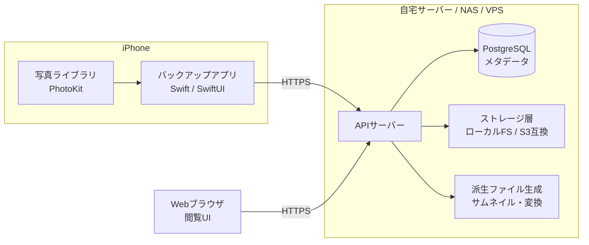
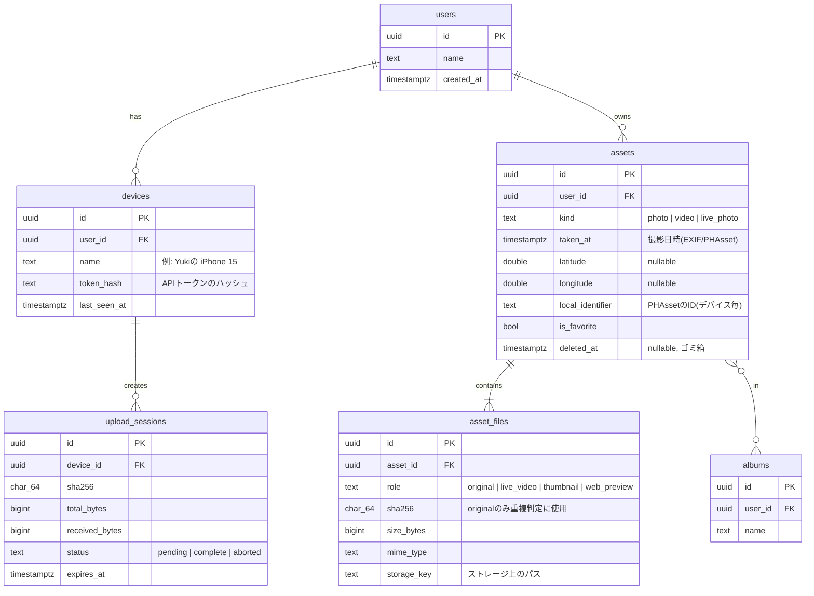
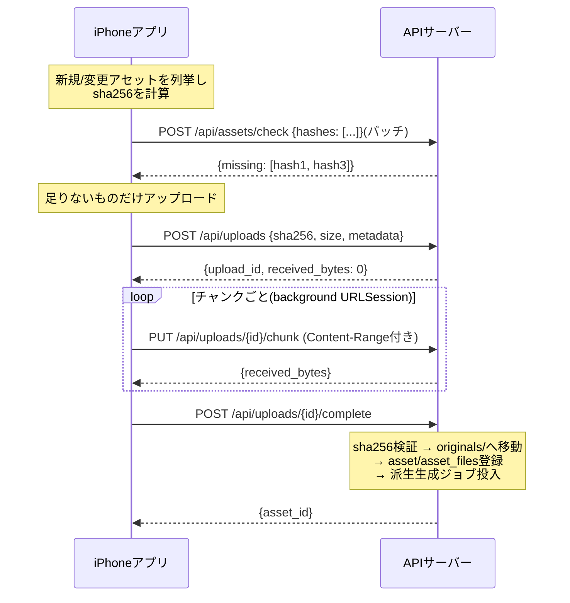

# media-storage 設計書

iPhone などのデバイスに保存された写真・動画を、自分の管理するストレージへ自動バックアップするシステムの設計ドキュメント。

> **前提文書: [要件定義書(REQUIREMENTS.md)](REQUIREMENTS.md)。** 本書の設計判断はすべて要件定義書の非機能要件と優先順位(耐久性 > 完全性 > 出口戦略 > … > 可用性)から導出している。対応関係は同書 §4 の対応表を参照。矛盾があれば要件定義書が勝ち、本書を直す。

- 目標: 「自分版 Google フォト / iCloud 写真」。オリジナルのファイルを劣化なしで自分のストレージに保存し、あとから閲覧・取り出しできること。
- 非目標(当面): 多人数向けの共有サービス、SNS 的機能、高度な AI 検索。

> 参考: 同じ目的の OSS として [Immich](https://immich.app/) や PhotoPrism があります。「まず動くものが欲しい」だけなら Immich の導入が最短ですが、本書は自作する前提で、これら先行事例の設計から学べる点を取り込んだ構成にしています。

---

## 1. 全体像

構成は「クライアント(iPhone アプリ) + 自前サーバー(API + ストレージ)」の 2 層です。



### 置き場所(媒体)の選択肢

「媒体は何でもいい」とのことなので、ストレージ層を抽象化して差し替え可能にします。現実的な選択肢と特徴:

| 置き場所 | 初期費用 | ランニング | 容量単価 | 備考 |
|---|---|---|---|---|
| 自宅の PC / Raspberry Pi + 外付け HDD | 安い | 電気代のみ | ◎ | 一番手軽。外出先アクセスは Tailscale 等で解決 |
| NAS (Synology 等) | 中 | 電気代のみ | ◎ | Docker が動く機種ならサーバーごと載せられる |
| VPS + オブジェクトストレージ | なし | 月額 | △ | 常時公開が簡単。容量課金が写真規模だと効いてくる |
| S3 / Backblaze B2 等クラウドのみ | なし | 月額 | ○ (B2 は安い) | サーバーは別途必要。バックアップ先の多重化に向く |

**推奨: まず自宅マシン(または NAS)+ ローカルファイルシステムで開始し、ストレージ層は最初からインターフェースで抽象化しておく。** 後から S3 互換(MinIO / B2)に差し替えたり、二次バックアップ先として追加したりできます。

### 技術スタック(推奨)

| 層 | 技術 | 理由 |
|---|---|---|
| iOS クライアント | Swift + SwiftUI, PhotoKit | 写真ライブラリへのフルアクセスとバックグラウンド転送はネイティブが最も確実 |
| API サーバー | TypeScript (Hono or Fastify) または Go | 単一バイナリ/コンテナで NAS でも動く軽さ。好みで選択可 |
| DB | PostgreSQL(小規模なら SQLite でも可) | メタデータ・重複判定・アルバム管理 |
| 画像処理 | libvips (sharp), ffmpeg | HEIC→JPEG、HEVC→H.264、サムネイル生成 |
| デプロイ | Docker Compose | NAS / Raspberry Pi / VPS どこでも同じ手順 |

> クライアントを Flutter / React Native にする選択肢もありますが、PhotoKit の変更監視・iCloud 最適化ストレージ対応・バックグラウンド URLSession はネイティブ API 前提の機能が多く、結局ネイティブモジュールを書くことになりがちです。片手間で作るならなおさら Swift 一択を推奨します。

---

## 2. 最重要の設計ポイント

自作でつまずきやすい順に挙げます。

### 2.1 オリジナルを一切加工せず保存する

- HEIC / HEVC / ProRAW / Live Photos の**元バイト列をそのまま保存**する。変換して保存すると画質・メタデータ(位置情報、深度情報等)が失われ、バックアップの意味が薄れる。
- 閲覧用の JPEG / H.264 / サムネイルは**サーバー側で派生ファイルとして別途生成**する(遅延生成でよい)。

### 2.2 重複排除はコンテンツハッシュで行う

- クライアントがアップロード前に **SHA-256 ハッシュ**を計算し、サーバーに「持ってる?」と問い合わせる(バッチで)。
- 既存ならアップロードをスキップ。これにより「途中で失敗して再実行」「複数デバイスから同じ写真」「アプリ再インストール」がすべて安全になる。
- ファイル名や撮影日時での重複判定は編集・コピーで簡単に壊れるので**やらない**。

### 2.3 アップロードは再開可能(resumable)にする

- 動画は数 GB になり得るため、**チャンク分割アップロード**と**中断再開**は必須。
- プロトコルは [tus](https://tus.io/)(再開可能アップロードの標準)をそのまま採用するか、後述のシンプルな自作 3 ステップ方式にする。自作でも仕様は小さい。

### 2.4 iOS の制約を最初から設計に織り込む

| 制約 | 対応 |
|---|---|
| アプリはすぐサスペンドされる | アップロードは **background URLSession** で行う(アプリが落ちても OS が転送を継続) |
| 定期的な自動実行は保証されない | **BGProcessingTask**(充電中+Wi-Fi 時に OS が起こしてくれる)+ アプリ起動時の差分同期の 2 本立て |
| 「iPhoneのストレージを最適化」で実体が端末にない | `PHAssetResource` 取得時に iCloud からのダウンロードが走る。Wi-Fi 時のみ・進捗表示・リトライを設計に含める |
| Live Photos は写真+動画の 2 ファイル | 2 つとも保存し、DB 上でペアとしてリンク |
| 写真ライブラリの変更検知 | `PHPhotoLibraryChangeObserver` で差分を取り、全走査は初回のみ |

### 2.5 セキュリティ

- 通信は **HTTPS 必須**。自宅サーバーの場合は
  - **Tailscale(推奨)**: 外部公開せず VPN 内だけで完結。証明書も Tailscale が面倒を見てくれる。最も安全で簡単。
  - または Caddy / Let's Encrypt でリバースプロキシを立てて公開。
- 認証はデバイスごとの **API トークン**(初回ペアリングで発行、サーバー側で失効可能)。マルチユーザーは将来拡張とし、スキーマだけ `user_id` を持たせておく。
- 将来オプション: クライアント側暗号化(E2E)。ただしサーバー側サムネイル生成と両立しないため、当面はやらない判断を明示しておく。

---

## 3. データモデル



ポイント:

- **asset(論理的な1枚) と asset_file(物理ファイル) を分離。** Live Photos(写真+動画)、オリジナル+派生ファイルが自然に表現できる。
- `sha256` に UNIQUE 制約(user 内)を張り、重複排除を DB レベルでも保証。
- 削除は `deleted_at` によるソフトデリート(ゴミ箱)。誤操作からの復元と、クライアント側の「削除済み」判定に使う。

## 4. ストレージレイアウト

コンテンツアドレス方式を採用します:

```
data/
├── originals/
│   └── ab/cd/abcd1234...ef.heic     # sha256 の先頭2+2文字でシャーディング
├── derived/
│   └── ab/cd/abcd1234...ef/
│       ├── thumb_256.webp            # グリッド表示用
│       ├── preview_2048.webp         # 閲覧用
│       └── video_720p.mp4            # HEVC非対応ブラウザ用(動画のみ)
└── db/                               # (SQLite採用時のみ)
```

- **originals はハッシュ名で保存 = 重複が物理的に起きない**。人間可読な「2026/07/」のような階層は DB が持つメタデータから**エクスポートツールで生成**する方針(ディスク上の構造とアプリの論理構造を分離)。
- 派生ファイルは**すべて再生成可能**なキャッシュ扱い。バックアップ対象は `originals/` と DB だけでよい。
- ストレージ層のインターフェースは `put / get / delete / exists` の 4 つに絞り、ローカル FS 実装 → S3 互換実装の差し替えを可能にする。

## 5. アップロードプロトコル

シンプルな 3 ステップ + チャンク方式(tus を採用する場合もフローは同じ):



- 中断時はクライアントが `GET /api/uploads/{id}` で `received_bytes` を確認して続きから送る。
- `complete` 時にサーバーが**ハッシュを再計算して検証**。一致しなければ破棄(転送破損対策)。
- メタデータ(撮影日時・GPS・Live Photo ペア情報・お気に入り)は `POST /api/uploads` の時点で JSON で送る。

## 6. API 一覧(v1)

| メソッド | パス | 用途 |
|---|---|---|
| POST | `/api/devices/pair` | 初回ペアリング(トークン発行) |
| POST | `/api/assets/check` | ハッシュのバッチ存在確認 |
| POST | `/api/uploads` | アップロードセッション作成 |
| PUT | `/api/uploads/{id}/chunk` | チャンク送信 |
| GET | `/api/uploads/{id}` | 再開位置の確認 |
| POST | `/api/uploads/{id}/complete` | 完了・検証 |
| GET | `/api/assets?from=&to=&cursor=` | タイムライン取得(ページング) |
| GET | `/api/assets/{id}/thumb` | サムネイル |
| GET | `/api/assets/{id}/preview` | 閲覧用プレビュー |
| GET | `/api/assets/{id}/original` | オリジナルのダウンロード |
| DELETE | `/api/assets/{id}` | ソフトデリート |

## 7. iOS アプリの構成

```
MediaBackup/
├── App/                    # SwiftUI エントリポイント
├── Features/
│   ├── Onboarding/         # サーバーURL入力 + ペアリング + 写真権限
│   ├── BackupStatus/       # 進捗表示(残り件数・転送速度・エラー)
│   └── Settings/           # Wi-Fiのみ/モバイル許可、対象範囲
├── Core/
│   ├── PhotoLibrary/       # PHAsset列挙・変更監視・リソース取得
│   ├── Hashing/            # ストリーミングSHA-256(メモリに載せない)
│   ├── UploadEngine/       # チャンク管理 + background URLSession
│   ├── SyncState/          # ローカルDB(GRDB/SQLite): アセットごとの同期状態
│   └── APIClient/
└── BackgroundTasks/        # BGProcessingTask 登録・スケジュール
```

同期状態はローカル SQLite に `(localIdentifier, sha256, 状態: 未送信/送信中/完了/失敗)` として持ち、**サーバーへの check 問い合わせを最小化**する。アプリ再インストール時はサーバーの check API だけで全件突合できる。

## 8. 開発ロードマップ

各フェーズが「単体で使える状態」で終わるように切っています。

### Phase 0: サーバー基盤(まずここから)
- Docker Compose で API + Postgres 起動
- ストレージ抽象化(ローカル FS 実装)
- check / upload / complete API と CLI テストスクリプト(手元の PC から `curl` や小さな CLI でアップロードできる = この時点で「PCの写真バックアップツール」として使える)

### Phase 1: iOS アプリ MVP
- ペアリング、写真権限、全件列挙+ハッシュ計算
- 手動「今すぐバックアップ」(フォアグラウンド+background URLSession)
- 進捗・エラー表示

### Phase 2: 自動化と閲覧
- BGProcessingTask による自動差分バックアップ
- Live Photos・iCloud 最適化ストレージ対応
- サムネイル/プレビュー生成(ジョブキュー)と最小限の Web タイムライン UI

### Phase 3: 充実化
- アルバム同期、お気に入り同期、ゴミ箱
- S3 互換ストレージ実装(二次バックアップ)
- エクスポートツール(`YYYY/MM/` 階層で書き出し)
- (任意)複数ユーザー、家族との共有

## 9. 運用上の注意

- **バックアップのバックアップ**: このシステム自体が壊れることに備え、`originals/` + DB ダンプを別媒体へ(例: B2 へ rclone を cron で)。「3-2-1 ルール」のうち本システムは 1 コピーに過ぎない。
- **容量見積り**: iPhone の写真ライブラリは平均的に 50〜500 GB。動画中心なら 1 TB 超もあり得るため、ディスクは余裕を持って 2 TB〜。
- **検証ジョブ**: 月次で originals のハッシュを再計算し、ビット腐敗を検知する簡単なスクラブ処理を入れると安心。
